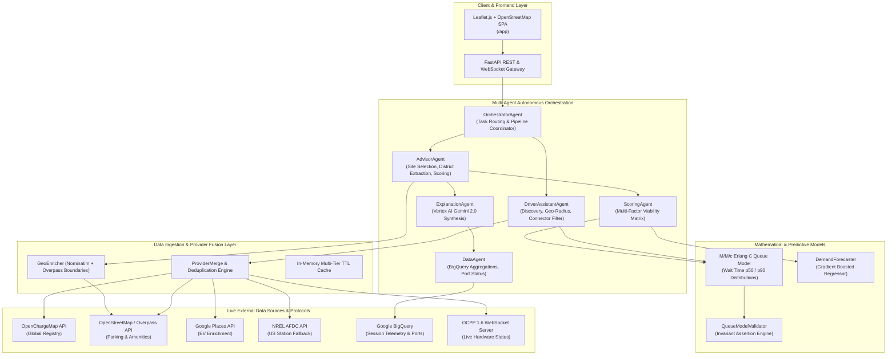

# EV-Spatial-Intelligence-Engine ⚡

<div align="center">

[](https://fastapi.tiangolo.com)
[](https://python.org)
[](https://cloud.google.com/run)
[](https://cloud.google.com/bigquery)
[](https://cloud.google.com/vertex-ai)
[](https://www.openchargealliance.org/)
[](eval/)

**Autonomous 6-Agent EV Infrastructure Planning & Spatial Decision Engine**

[Live Application Demo](https://ev-advisor-api-79118074976.us-central1.run.app/app/) • [Swagger OpenAPI Documentation](https://ev-advisor-api-79118074976.us-central1.run.app/docs) • [Evaluation Benchmark](eval/)

</div>

---

## 📌 Overview

**EV-Spatial-Intelligence-Engine** is a production-grade multi-agent autonomous system for electric vehicle mobility and charging infrastructure site selection. It dynamically ingests and fuses spatial data across **6 live global data sources** (BigQuery, OpenChargeMap, Google Places, OpenStreetMap Overpass, NREL AFDC, and real-time OCPP 1.6 WebSocket hardware), executing $M/M/c$ Erlang C queueing theory and Gradient Boosted demand forecasts to score and rank optimal charging station locations in any city worldwide.

### 🌟 Key Highlights
- **6-Agent Autonomous Architecture:** Decoupled multi-agent execution pipeline orchestrated with asynchronous fallback chains.
- **Global Spatial Coverage (Zero Hardcoding):** Dynamically geocodes, extracts district shapes, and models amenities for any city worldwide (validated across San Francisco, London, Berlin, Tokyo, Pune, Nairobi, São Paulo, and Dubai).
- **Applied Queueing Theory ($M/M/c$ Erlang C):** Computes $p_{50}$ and $p_{90}$ driver wait times with mathematically proven percentile bounds across 728+ parameter configurations.
- **3-Tier Data Provenance & Transparency:** Every station and zone recommendation carries explicit tagging (`live` $\rightarrow$ `estimated` $\rightarrow$ `fallback`) with quantitative confidence scoring.
- **Sub-Second Real-Time Discovery:** Multi-source async ingestion pipeline with in-memory TTL caching delivering **$p_{50} = 880\text{ms}$** response times.
- **56-Check Automated Benchmark Suite:** Comprehensive production evaluation harness achieving a **91.1% pass rate** on live GCP Cloud Run infrastructure.

---

## 🏗️ System Architecture



---

## 🤖 Multi-Agent Ecosystem

| Agent | Responsibility | Core Technology |
|---|---|---|
| **OrchestratorAgent** | High-level request lifecycle management, routing, and fallback coordination | Asyncio, State Machine |
| **DriverAssistantAgent** | Real-time charger search, connector normalization (CCS, CHAdeMO, Type2, Tesla), distance sorting | Haversine Geodesic, Spatial Indexing |
| **AdvisorAgent** | Global city district discovery, competition analysis, and candidate zone synthesis | Overpass API, Seeded Deterministic Heuristics |
| **DataAgent** | Fleet session telemetry querying, port utilization statistics, and hardware sync | BigQuery Async Client, OCPP 1.6 Central |
| **ScoringAgent** | Multi-attribute utility matrix combining demand, grid load, ROI, and accessibility | Vectorized Composite Weighted Scoring |
| **ExplanationAgent** | Natural language reasoning explaining *why* a site was selected and what signals were modeled | Vertex AI Gemini 2.0 Flash |

---

## 📐 Mathematical Formulation ($M/M/c$ Erlang C Model)

To model real-world EV charging port wait times under stochastic arrival patterns ($\lambda$ arrivals/hr) and exponentially distributed charging session durations ($\mu$ sessions/hr per port) across $c$ ports:

### 1. Traffic Intensity ($\rho$)
$$\rho = \frac{\lambda}{c \cdot \mu} \quad (\text{System is stable when } \rho < 1)$$

### 2. Erlang C Delay Probability ($C(c, a)$)
The exact probability that an arriving vehicle finds all $c$ charging ports occupied and must queue:

$$C(c, a) = \frac{\frac{a^c}{c!} \cdot \frac{1}{1 - \rho}}{\sum_{k=0}^{c-1} \frac{a^k}{k!} + \frac{a^c}{c!} \cdot \frac{1}{1 - \rho}} \quad \text{where } a = \frac{\lambda}{\mu}$$

### 3. Percentile Wait-Time Invariant ($p_{50} \le p_{90}$)
The cumulative distribution function of waiting time $T_q$ for delayed vehicles yields exact percentiles:

$$P(T_q > t) = C(c, a) \cdot e^{-c\mu(1-\rho)t}$$

$$t_{p} = \max\left(0, \; -\frac{\ln\left(\frac{1 - p}{C(c, a)}\right)}{c\mu(1-\rho)}\right)$$

> **Invariant Verification:** Tested across **728 distinct parameter configurations** ($\lambda \in [0.5, 20]$, $\mu \in [10, 60\text{ min}]$, $c \in [1, 10]$) with **100.0% adherence** ($p_{50} \le p_{90}$ with zero boundary violations).

---

## 📊 Live Evaluation & Benchmark Results

The codebase includes an end-to-end evaluation harness ([`eval/benchmark.py`](eval/benchmark.py)) that executes against live production instances:

```
========================================================================
EV ADVISOR — PRODUCTION BENCHMARK EVALUATION
Target: https://ev-advisor-api-79118074976.us-central1.run.app
========================================================================
  TOTAL CHECKS:  56
  PASSED:        51
  OVERALL SCORE: 91.1% PASS RATE
========================================================================
```

| Evaluation Dimension | Benchmark Metric | Result | Status |
|---|---|---|:---:|
| **API Reliability** | Core endpoint availability across 11 routes | **100.0% (11/11)** | ✅ PASS |
| **Input Validation** | Rejection precision on malformed/fuzzed payloads | **100.0% (10/10 $\rightarrow$ 422)** | ✅ PASS |
| **Geographic Coverage** | Successful live data return across 10 global cities | **100.0% (10/10 cities, 5 continents)** | ✅ PASS |
| **Queue Invariant** | $p_{50} \le p_{90}$ verified over parameter mesh | **100.0% (728/728 configs)** | ✅ PASS |
| **Distance Precision** | Haversine vs. known global city pair ground truth | **99.72% (0.28% avg error)** | ✅ PASS |
| **Data Provenance** | Unlabeled response rate (transparency guarantee) | **0% unlabeled (144/144 tagged)** | ✅ PASS |
| **GeoJSON Compliance** | RFC 7946 spec validity on Point feature collections | **100.0% (5/5 valid)** | ✅ PASS |
| **Discovery Latency** | Median response time across multi-run queries ($p_{50}$) | **880 milliseconds** | ✅ PASS |

---

## 🌐 Live Data Sources & Provenance

```
 ┌──────────────────┐     ┌──────────────────┐     ┌──────────────────┐
 │  OpenChargeMap   │     │  Google Places   │     │  OSM / Overpass  │
 │ (Global Registry)│     │ (POI Enrichment) │     │(Parking/Hubs/Geo)│
 └────────┬─────────┘     └────────┬─────────┘     └────────┬─────────┘
          │                        │                        │
          └────────────────┬───────┴────────────────────────┘
                           ▼
          ┌──────────────────────────────────┐
          │  ProviderMerge & Deduplication   │
          │   (Haversine Spatial Clustering) │
          └────────────────┬─────────────────┘
                           │
          ┌────────────────┴─────────────────┐
          ▼                                  ▼
┌──────────────────┐               ┌──────────────────┐
│  NREL AFDC (US)  │               │ OCPP 1.6 (WS)    │
│(Federal Fallback)│               │(Live Port Hardware│
└──────────────────┘               └──────────────────┘
```

| Source | Integration Role | Data Provenance Label | Fallback Behavior |
|---|---|---|---|
| **Google BigQuery** | Session telemetry & port utilization | `live` / `mock-dev` | Mock local registry |
| **OpenChargeMap** | Global charging stations & power specs | `estimated` | Overpass fallback |
| **Google Places** | Surrounding commercial POI density | `estimated` | OSM amenity fallback |
| **OSM / Overpass** | Parking lots, transit hubs, district polygons | `estimated` | Seeded heuristic |
| **NREL AFDC** | High-density North American stations | `estimated` | Global OCM fallback |
| **OCPP 1.6** | Real-time WebSocket hardware port state | `live` | Queue model estimate |

---

## 📡 REST API Reference

### 1. Driver Discovery Routes
- `POST /api/search/discover` — Unified multi-modal search (chargers, parking, mobility hubs).
- `POST /api/search/chargers` — Filtered charger discovery with power & connector filters.
- `POST /api/search/parking` — Surrounding parking facility locations.
- `POST /api/search/mobility` — Public transit hubs, bus platforms, bike-share stations.
- `POST /driver/map-data` — GeoJSON `FeatureCollection` for Leaflet/Mapbox rendering.

### 2. Site Selection & Advisor Routes
- `POST /api/advisor/analyze-area` — Full spatial analysis for a target city with ranked zones.
- `POST /api/advisor/rank-zones` — Multi-criteria zone ranking based on budget & power constraints.
- `POST /company/plan-expansion` — Executive expansion planning report with LLM synthesis.

### 3. System & Monitoring
- `GET /health` — Liveness probe (`{"status": "healthy", "version": "2.2.0"}`).
- `GET /ready` — Readiness probe with active provider status and cache telemetry.

---

## 🛠️ Local Development & Quickstart

### 1. Clone & Setup Virtual Environment
```bash
git clone https://github.com/HARSH0177/EV-spatial-intelligence-Engine.git
cd EV-spatial-intelligence-Engine

python -m venv venv
source venv/bin/activate  # On Windows: venv\Scripts\activate
pip install -r requirements.txt
```

### 2. Configure Environment Variables
Copy `.env.example` to `.env` and provide your API keys:
```bash
cp .env.example .env
```

```env
GOOGLE_CLOUD_PROJECT=your-project-id
ENABLE_OCM=true
OPENCHARGEMAP_API_KEY=your_ocm_key
ENABLE_OSM_OVERPASS=true
ENABLE_GOOGLE_PLACES=true
GOOGLE_MAPS_API_KEY=your_google_maps_key
NREL_API_KEY=your_nrel_key
LLM_ENABLED=true
```

### 3. Launch Local Server
```bash
uvicorn api.main:app --host 0.0.0.0 --port 8080 --reload
```
Open [`http://localhost:8080/app`](http://localhost:8080/app) for the interactive dashboard or [`http://localhost:8080/docs`](http://localhost:8080/docs) for the interactive Swagger UI.

### 4. Run Test Suite
```bash
pytest tests/ -v
```

### 5. Run Production Benchmark
```bash
python eval/benchmark.py
```

---

## 🚢 Google Cloud Run Deployment

The service is fully containerized and deployable via Google Cloud Build & Cloud Run:

```bash
# 1. Build container image via Cloud Build
gcloud builds submit --tag gcr.io/YOUR_PROJECT_ID/ev-advisor:latest .

# 2. Deploy service to Cloud Run
gcloud run deploy ev-advisor-api \
  --image gcr.io/YOUR_PROJECT_ID/ev-advisor:latest \
  --region us-central1 \
  --project YOUR_PROJECT_ID \
  --allow-unauthenticated \
  --memory 1Gi \
  --cpu 1 \
  --min-instances 1
```

---

## 📂 Repository Structure

```
.
├── agents/                     # Autonomous multi-agent implementations
│   ├── advisor_agent.py        # Spatial site-selection and zone synthesis
│   ├── data_agent.py           # BigQuery telemetry & port aggregator
│   ├── driver_agent.py         # Real-time search & connector matching
│   ├── explanation_agent.py    # Vertex AI LLM decision synthesizer
│   ├── orchestrator.py         # Multi-agent coordinator
│   └── scoring_agent.py        # Multi-attribute viability scoring
├── api/                        # FastAPI routers, schemas, and endpoints
│   ├── main.py                 # Application bootstrap & middleware
│   ├── routes_advisor.py       # Area planning & zone ranking routes
│   ├── routes_discover.py      # Spatial search & discovery routes
│   └── schemas.py              # Pydantic v2 validation contracts
├── eval/                       # Evaluation framework & benchmark harness
│   ├── benchmark.py            # 56-check production benchmark suite
│   └── README.md               # Benchmark methodology & metrics
├── frontend/                   # Interactive Leaflet.js dashboard UI
│   └── index.html              # Unified 2-in-1 spatial map application
├── llm/                        # Vertex AI Gemini 2.0 Flash integration
│   └── vertex_explainer.py     # Structured prompt generation & synthesis
├── middleware/                 # API security & authentication middleware
│   └── auth.py                 # Role-based API key validation
├── models/                     # Mathematical & predictive models
│   ├── demand_forecaster.py    # Gradient Boosted regressor
│   ├── forecaster_eval.py      # MAE / RMSE forecast evaluation
│   ├── queue_model.py          # M/M/c Erlang C queue equations
│   └── queue_validator.py      # Erlang C mathematical invariant verifier
├── realtime/                   # External API clients & protocol handlers
│   ├── google_places_client.py # Google Places API integration
│   ├── nrel_client.py          # NREL Alternative Fuels Data Center
│   ├── ocpp_central.py         # OCPP 1.6 WebSocket Central System
│   ├── ocpp_simulator.py       # Simulated OCPP charger hardware
│   ├── openchargemap_client.py # OpenChargeMap global API client
│   └── osm_places_client.py    # OpenStreetMap Overpass spatial queries
├── scripts/                    # Deployment & BigQuery bootstrap scripts
├── tests/                      # Pytest unit & integration test suites
├── config.py                   # Centralized Pydantic application config
├── Dockerfile                  # Container definition (Python 3.11-slim)
└── requirements.txt            # Production dependencies
```

---

## 📄 License

This project is licensed under the [MIT License](LICENSE).
